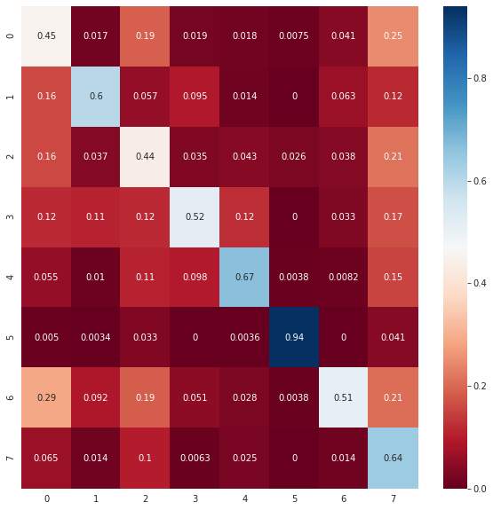
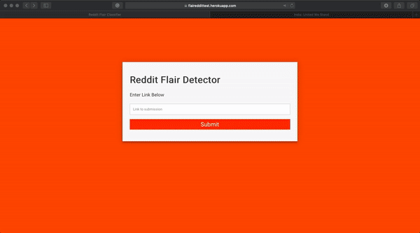

# *FlaiReddit*
FlaiReddit is an end to end web-app deployed on Heroku that classifies the flair tags from posts in r/india. The project is strurctured in 5 steps.

## RedditCrawler - Web Scraper
The data extractor extracts posts from a wide time period to eliminate the Bias towards some hot topics.
* You can save and load your progress at checkpoints too (especially useful for online collection and storage), 
* Approximately  600 posts can be extracted per second, however as a result of the moderation of the subreddit only 20% of the data is actually available. 
* All logs are made in crawler.log, warnings are displayed.
* To optimize space removed, empty flairs are removed batch wise.

```python
from modules.crawler import *
start_time = #Enter the unix timestamp of date since when scraping should begin
end_time= #Enter the unix timestamp of date since when scraping should end
scraper = Crawler(size=1000, difference=12, sleep=0.5, start=start_time)

while(scraper.current > end time):
	red.query() #Query the database
red.dump() #Dump the stats and csv
```

A commited notebook is available at [kaggle](https://www.kaggle.com/someshsingh22/redditcrawlertest)

## Exploratory Data Analysis
Extensive analysis has been done, important words are visualized through WordClouds, in depth explanation of these and preprocessing is present in my [Notebook](https://github.com/someshsingh22/FlaiReddit-MIDAS/blob/master/Notebooks/Part-2-EDA.ipynb)

>A baseline model from BOW is also implemented at the end.
## Training the Model [BERT, TFIDF]
We set the seed for reproducibility and use BERT - *uncased, base*, freezing all layes apart from the last layer and the weights are saved for easier inference at : 

**Model Summary [Inference Time]**:
| Model | Micro-F1  |Macro-F1  | CPU Inference Time
|--|--|--|--|
| TFIDF Combined | 0.51 | 0.50  | **331 Samples/s**
| BERT | **0.60** | **0.59**  |	2.37 Samples
| TFIDF , Feats | 0.49 | 0.48  | 273 Sample/s



## WebApp - Flask TFIDF
* For the web app we have used the TFIDF model keeping the CPU Rate and Memory Usage in mind [BERT BASE has 114 M parameters].
* The app is created on flask, the root view is a simple webpage where you can enter the weblink and the predicted flair is displayed.
* The other end point is \auto, to which a post request is sent and the prediction json is sent back.
* Logs and Error pages will be enabled in a future update.
* The colour theme used is taken from reddit's own theme :)

 **Root page :**
```bash
cd app
python main.py
* Running on http://127.0.0.1:5000/
```


**Auto Endpoint**
```python
>>> import requests
>>> with open('file.txt','wb') as f:
		f.write(b"https://www.reddit.com/r/india/comments/g8fyzr/tejas_aircraft_aerodynamics_analysis_the_swedish/")
#Science/Technology
'''
Using the method for post queries
'''
>>> files = {'upload_file': open('file.txt','rb')}
>>>> r = requests.post(url, files=files)
>>> r
<Response [200]>
>>> r.json()
{"https://www.reddit.com/r/india/comments/g8fyzr/tejas_aircraft_aerodynamics_analysis_the_swedish/" : 'Science/Technology'}
```
## HEROKU DEPLOYMENT
Finally the web application is deployed on Heroku and is available at [FlaiRedditTest](https://flaireddittest.herokuapp.com/), all Automation is available at [FlaiReddiTest/auto](https://flaireddittest.herokuapp.com/auto)
> Here is a snapshot of a correct classification on android

 Similar to the local webapp you can access the Automated endpoint and root get view by just replacing http://127.0.0.1:5000/ with https://flaireddittest.herokuapp.com/

 **Final Android View**


